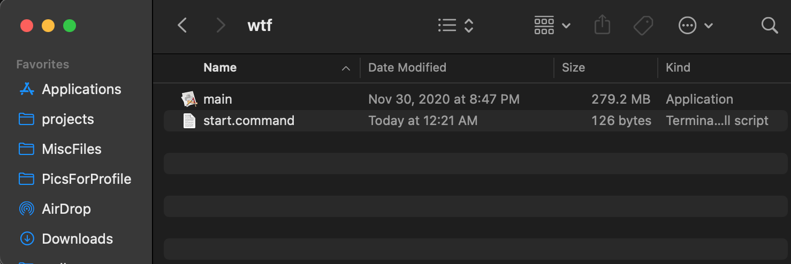
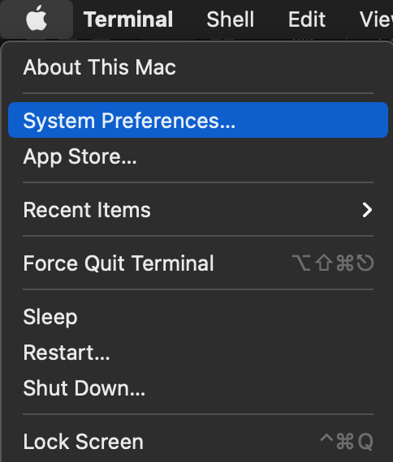
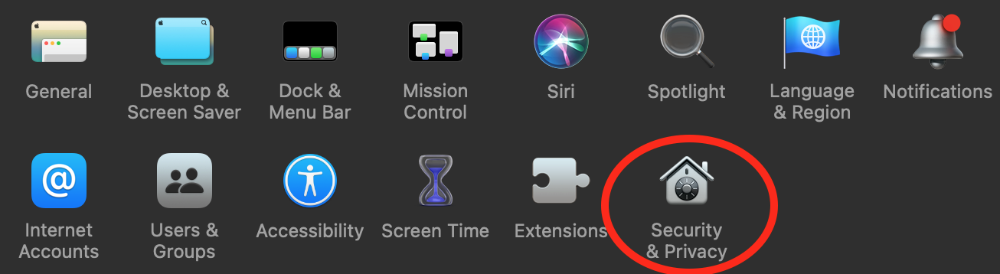
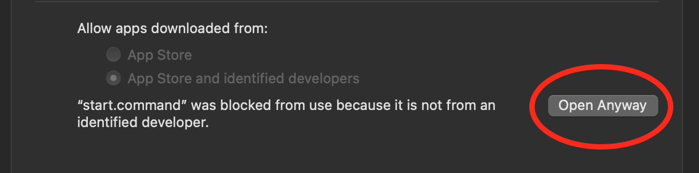

[<- Back to main site.](https://whats-this-facebook.github.io/Personal-Data-Visualization-Tool/)

## How do I run the application downloaded via the zip file above?
1. Once you have installed the zip file, be sure to unzip(decompress) it.  
After doing this, you should have a folder that contains two files.  
Ensure that the folder's name does not have any spaces in it (this can happen if you download the folder multiple times).


2. Double click the *start.command* file.  
You should see a security warning.  
Click *OK*.  
  

3. Navigate to your *System Preferences*.  


4. Navigate to your *Security and Privacy* settings.  


5. Select the *General* option at the top of the window.  


6. You should see a button towards the lower right of the screen that says *Open Anyway*.  
Click this button.  


7. Navigate back to the folder you unzipped.  
This time, click on the *main* file.  
You should see another security warning.  
Click *Cancel* this time.  
  

8. Repeat steps 3 thru 5.  

9. You should now be able to start the application by clicking on the *start.command* file.  
Make sure that the *main* file is in the same directory when you do this.  

  
<br/>
## How do I build using the source code?  (relevant to developers only)
1. Set up a Python environment with Python 3.7 - 3.9.
2. Download the source code for *"What's this, Facebook!?"* with a git clone.
3. Install the libraries *PySimpleGUI, matplotlib, pandas, descartes, geopandas,* and *cities_coordinates* into your environment.  
This can be done via pip, as shown below.

```
pip3 install PySimpleGUI
pip3 install matplotlib
pip3 install pandas
pip3 install descartes
pip3 install geopandas
pip3 install cities_coordinates
```
